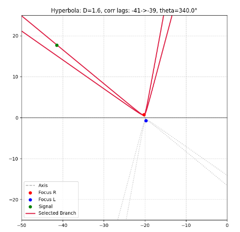

# localization_exercises
# This repositoriy will contain python codes important in using multiple hydrophones to localize sound sousrces.
# Exercise #1

## Problem statement:

### A two hydrophone array receives signals that are recorded in a stereo wave file.
### The array is specified thusly:
###    Separation between the two hydrophones: 1.1 m
###    The array is oriented with the L channel -> Right channel axis rotated in a horizontal plane 60 deg clockwise from North.
###    The speed of sound is: 1485 m/s
    
## The question:
###    For each of the 4 calls in the wav and lable files, what are the likely bearing angles relative to North for the signals received in each call.

# Exercise #2

## Problem statement:

### A binaural array has been deployed at an x,y,z location relative to a local geographic waypoint with the axis from the L channel to the R channel is set to a given bearing angle measured positive when clockwise from North.
### A variety of calls come from various nearby locations.  These locations are unknown. The calls are recorded in a wav format file.

## The question:
### What can you determine about these calls and how sure are you in your conclusions?

### Since this is a model problem, we know where the calls were when the wav file was synthesized.  Compare your location notions with the known sources.
### And example: (The two hyperbolas are drawn with correlation lags one less and one more than the one computed from the wav file.)

    
## meta data:  
### generated_sound_high_s2n.wav, generated_sound_low_s2n.wav, generated_labels.txt
### array_location = np.array([-20, 0, -10, 340], dtype=np.float64)  #  x, y, z in meters, bearing angle
### local_ref_lat_lon = [48.55841, -123.17327]
### speed_of_sound = 1485  # m/s
### hydrophone_separation = 1.6  # Fixed separation in meters
### when needed, ask for the original source locations

